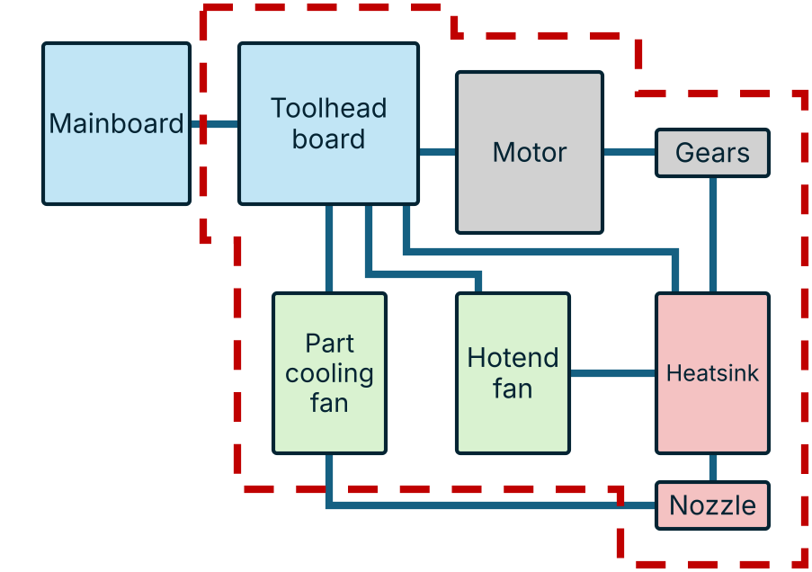
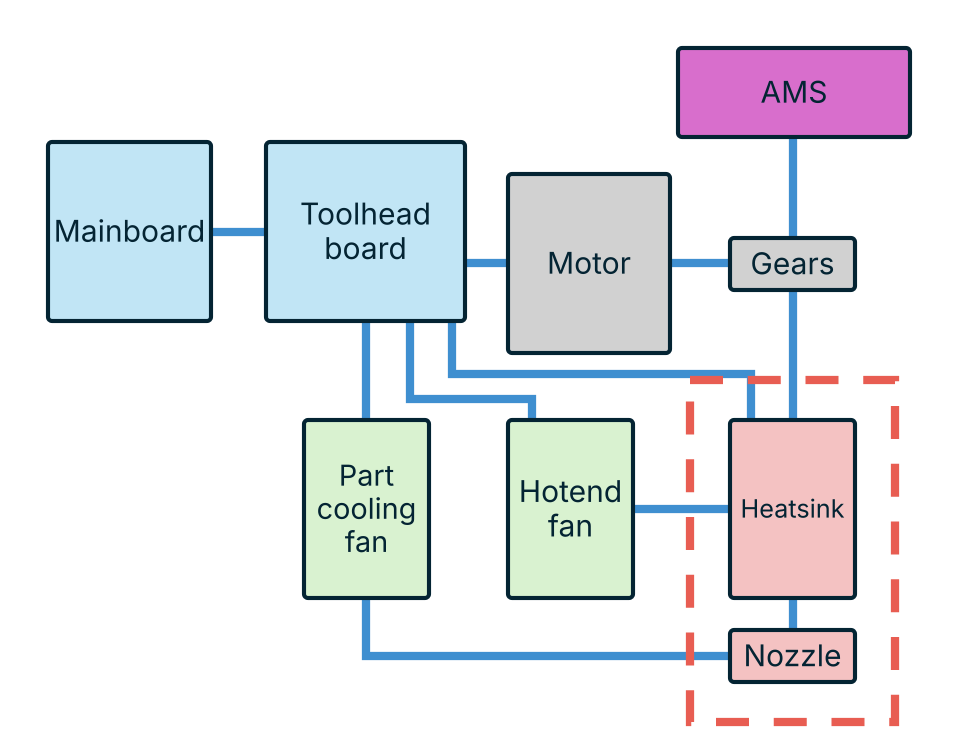

# Toolchanger Classes

## Why this site exists

'Toolchanger' is a word covering a lot of different systems. A printer that
parks a complete toolhead and one that swaps a bare nozzle both get called
toolchangers, and both get compared on tool count and change time as though that
made them comparable.

What separates them is where the tool-toolhead/carraige split is drawn. Everything inside that split is
duplicated on every tool, which sets the cost per tool and the moving mass.
Everything crossing the cut is a joint that gets broken and remade at every
change, which sets the failure modes. A full fat toolhead changer and a nozzle
changer sit at opposite ends of that and have very little in common mechanically.

There are no settled names for any of this, so discussion falls back on brands
and project names. Someone asking which approach suits them gets a list of
designs rather than a way to tell them apart.

This site is an attempt at a vocabulary. Three classes and eight subtypes, each
defined by where the split is made, with the same block diagram redrawn for each so
the difference is visible rather than argued over. It follows the approach of
[Happy Hare's conceptual MMU nomenclature](https://github.com/moggieuk/Happy-Hare/wiki/Conceptual-MMU),
which did the same job for multi-material units.

## Toolchanger classes

Read the diagrams as a map of one toolhead. The dashed outline is the tool: the
part that leaves with a change. Anything inside it exists once per tool. Anything
the outline crosses is a connection that has to survive being pulled apart and
put back together, over and over. Click any panel below for that subtype's page.

--8<-- "plate.html"

### Conventional toolchangers

In a conventional toolchanger the tool
is a toolhead. Extruder motor, gears, both fans, hot end and usually its own
control board all travel, and the carriage is reduced to a mount and a coupling.
Filament stays loaded in the tool between changes.

{ .tc-class-fig }

This is the oldest arrangement and the easiest to reason about, because a tool is
just a toolhead that can be parked. It is also the most expensive (in theory) way to add a
colour, and it puts the most mass on the coupling. Redundant electronics are needed for every tool. Splitting between
[full](subtypes/full-conventional.md) and
[partial](subtypes/partial-conventional.md) conventional comes down to
whether the part cooling fan and all of toolhead electronics or just some travel too.

### Filament path changers

A filament path changer cuts somewhere
along the filament path instead of above it. The extruder is split or left behind
entirely, so the tool carries a shorter piece of the chain — the drive gears and
hot end, the hot end and its heat break fan, or just the heat break and nozzle.
Filament is withdrawn past the cut before a change and re-fed after.

{ .tc-class-fig }

Tools get cheaper and lighter the further down the cut moves, but the filament
handling gets much harder and more crosses the joint. Heater current and thermistor
signal have to reach a part that keeps detaching, which is what separates the
[inductive and pogo](subtypes/inductive-pogo.md) designs from the
[wired](subtypes/wired.md) ones.

### Hotend changers

A hotend changer leaves the filament path on the
machine. One extruder and one filament system, usually an AMS, feed whichever hot
end or nozzle is mounted, and the tool is only the hot zone.

{ .tc-class-fig }

This is the cheapest thing to duplicate and adds the least mass, at the cost of
depending on the material system to load and retract reliably, and of every
change costing a purge. Mechanically the changing system also has to have more complex movements to swap a nozzle- this is readily apparant in Bambu Lab Vortek's multirail system and the Swapper3Ds rotating carrage and actuation arm. Where the cut falls between the
[heat break](subtypes/ams-assisted-hotend-changer.md) and the
[nozzle alone](subtypes/ams-assisted-nozzle-changer.md) decides whether
tools can differ in anything but nozzle geometry.

### Trade-offs

There is no free lunch in any of this. None of the three classes removes
complexity, they move it somewhere else, and the choice is where you would rather
deal with it.

| Class | Goal | Compromise |
| --- | --- | --- |
| Conventional | Straightforward and safe. A tool is a toolhead, so nothing about extrusion has to be re-solved. | High demands on the kinematic mount, and difficult cost management once you want to fit a large number of tools. |
| Filament path changers | Low cost, largely passive tools, which makes fitting a lot of them easy. | Very difficult to design a filament path and extrusion system that still still produces quality prints, is reliabile and supports flexible materials. |
| Hotend changers | A minimalist tool and the highest tool counts. | Very complex handling for tool storage and for the changing mechanism itself. |

## Credits

The toolchanger tables this site is built on were compiled by
[ukdavewood](https://github.com/ukdavewood). Diagrams, taxonomy and site by
[Robert Samples](https://github.com/robertsamples).
