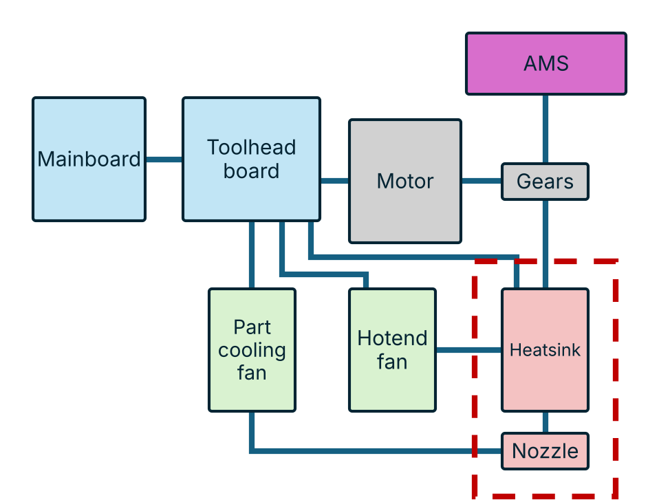

# Toolchanger separation plane

--8<-- "plate.html"

## Toolchanger classes

### Conventional toolchangers

Full conventional

{ .tc-detail-fig }

_Description to follow._

--8<-- "type-full_conventional.md"

Partial conventional

{ .tc-detail-fig }

_Description to follow._

--8<-- "type-partial_conventional.md"

### Filament path changers

Gear swapping

{ .tc-detail-fig }

_Description to follow._

--8<-- "type-gear_swapping.md"

Hotend fan swapping

{ .tc-detail-fig }

_Description to follow._

--8<-- "type-hotend_fan_swapping.md"

Inductive / pogo changers

{ .tc-detail-fig }

_Description to follow._

--8<-- "type-inductive_pogo.md"

Wired

{ .tc-detail-fig }

_Description to follow._

--8<-- "type-wired.md"

### Nozzle changers

AMS-assisted toolchangers

{ .tc-detail-fig }

_Description to follow._

--8<-- "type-ams_assisted_toolchanger.md"

AMS-assisted nozzle changers

{ .tc-detail-fig }

_Description to follow._

--8<-- "type-ams_assisted_nozzle_changer.md"

## All systems

--8<-- "systems-all.md"
