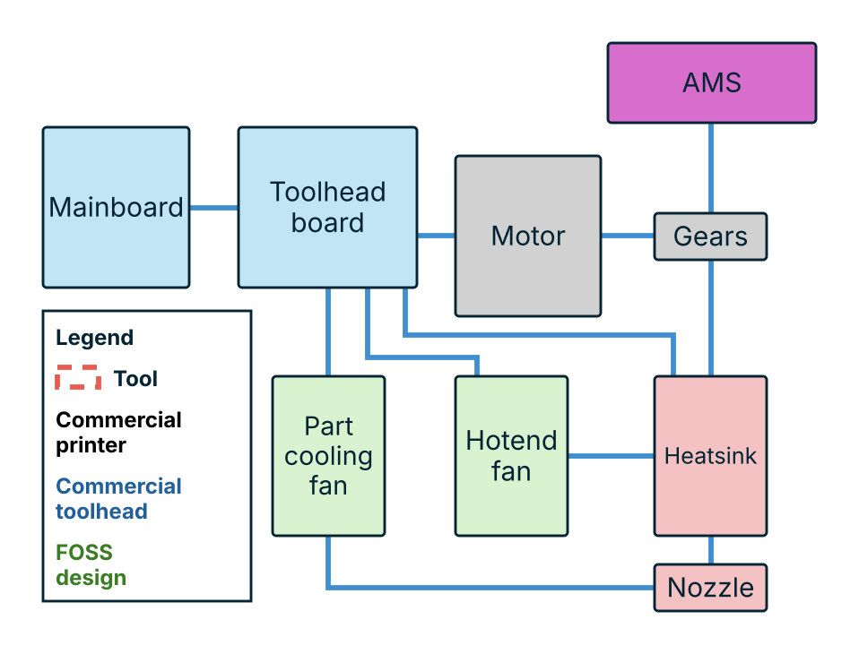
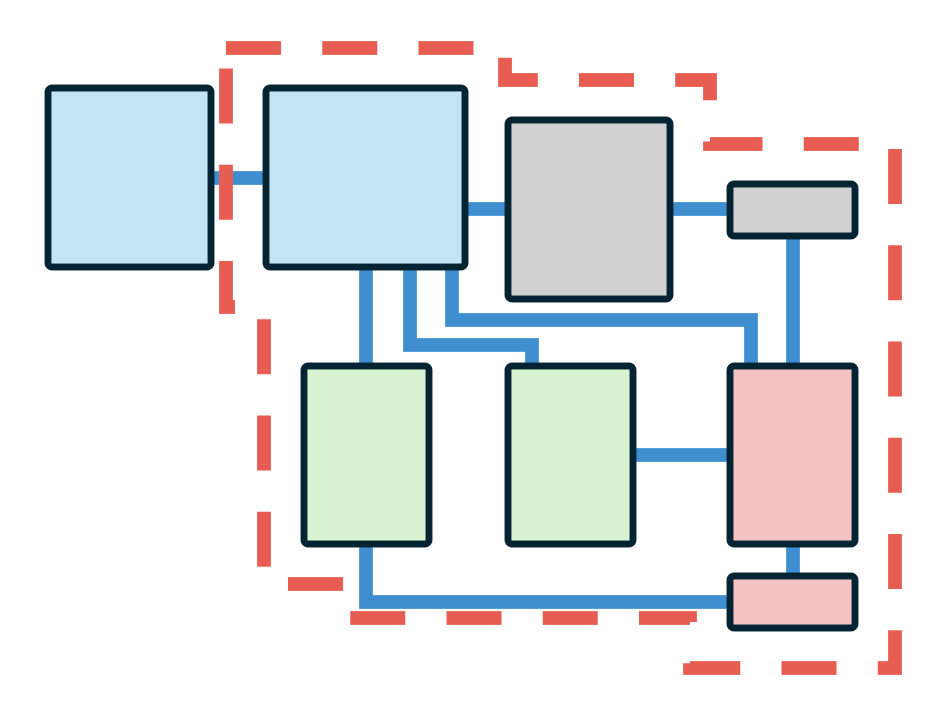
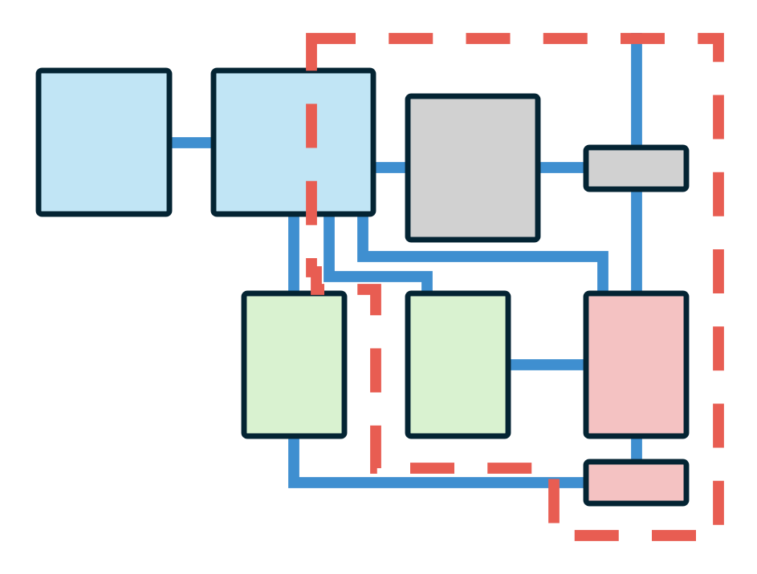
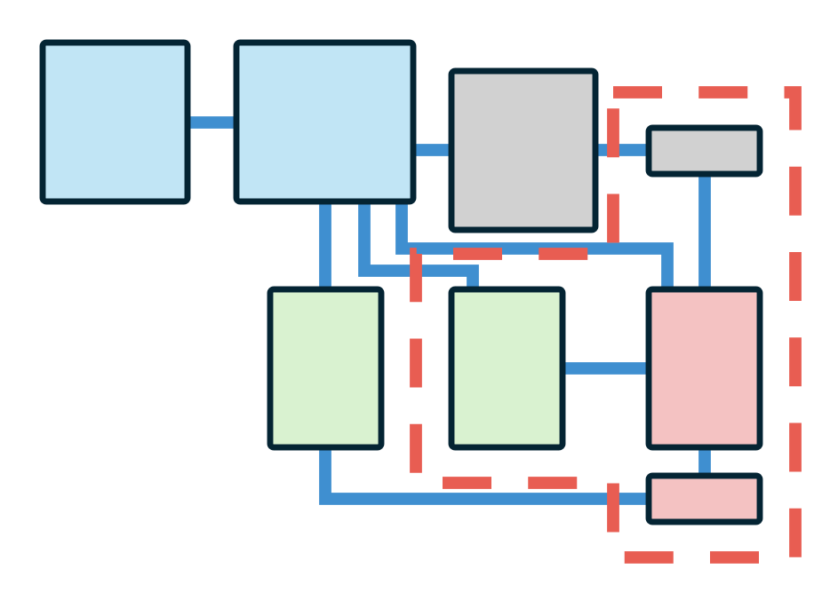
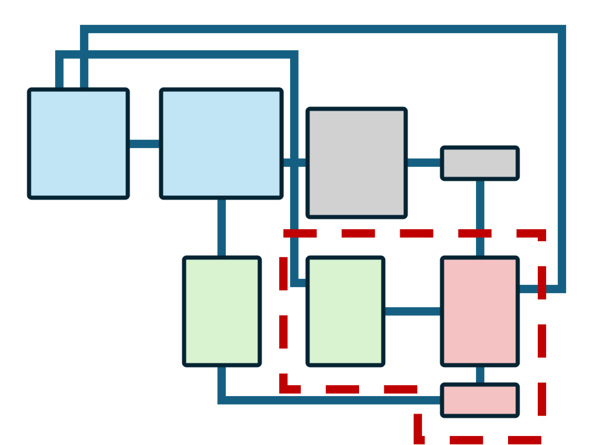
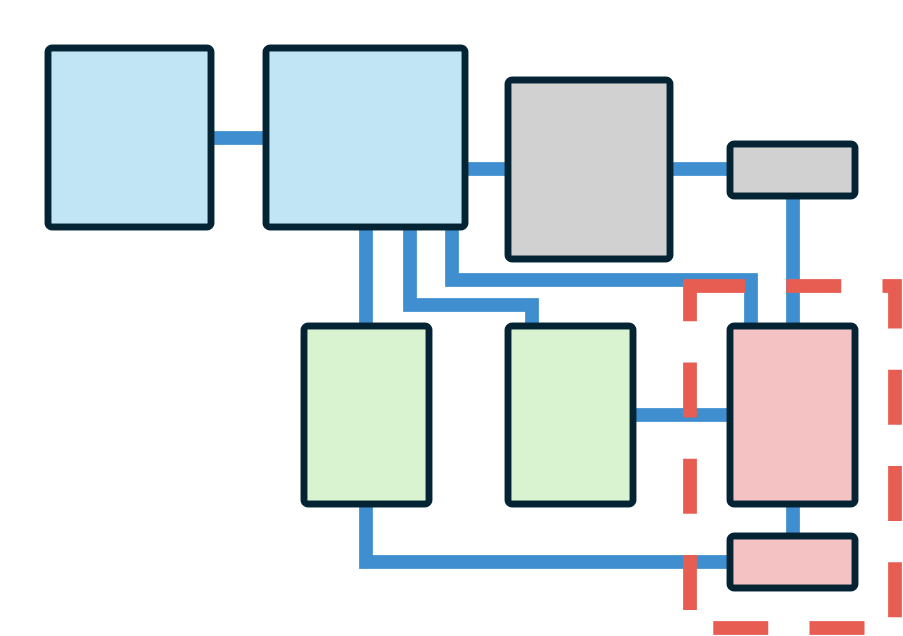
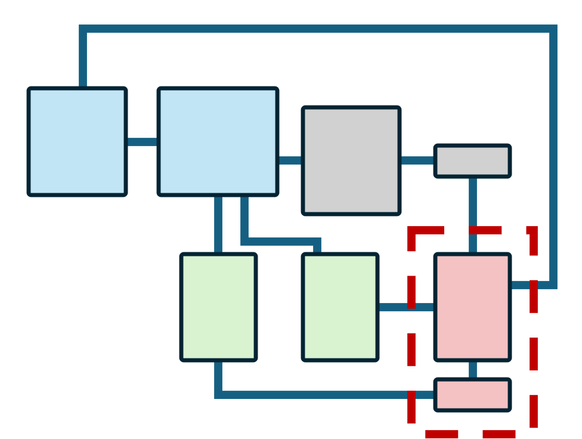
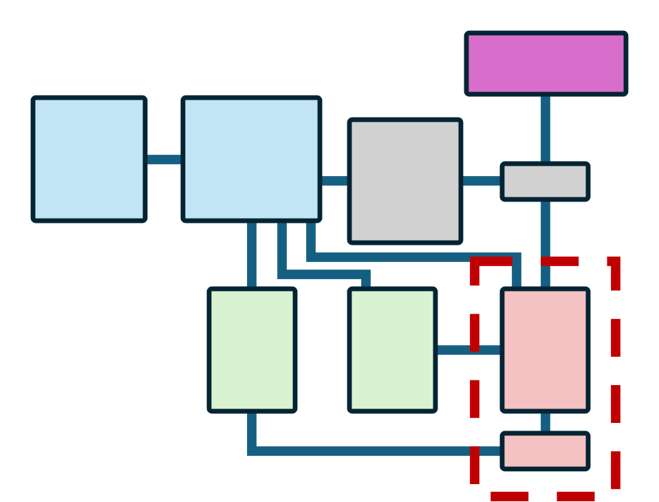
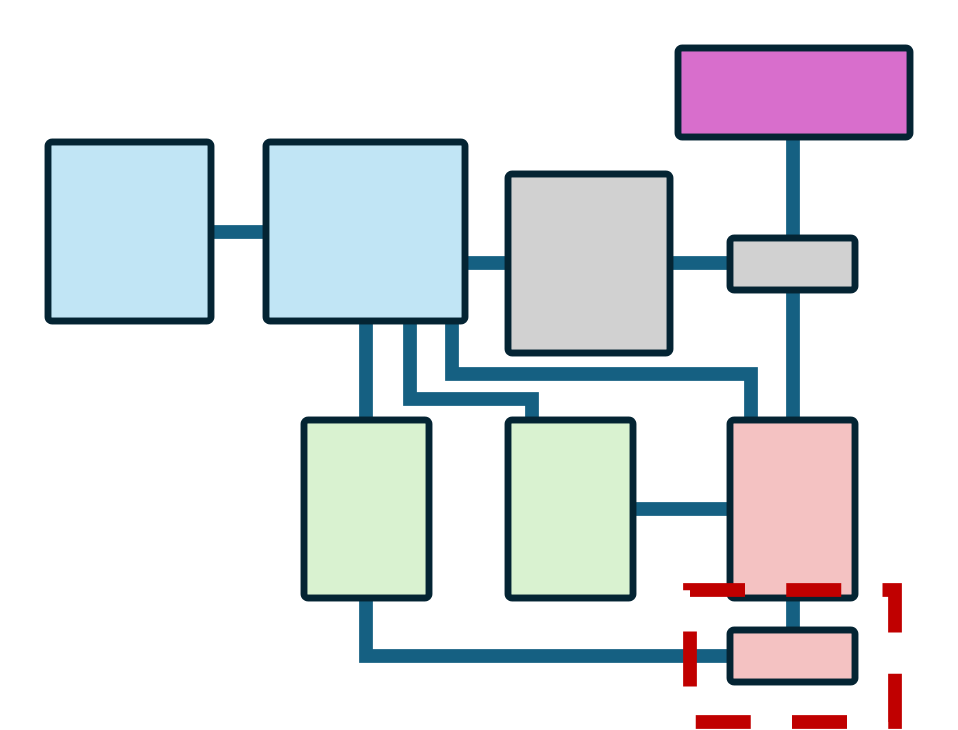

# Toolchanger separation plane

Conventional toolchangers

<a class="tc-cell" href="#type-full_conventional">Full conventionalPrusa XLE3D toolchangerStealthchangerTapchangerMadamDakshLineux<em>Description to follow.</em></a><a class="tc-cell" href="#type-partial_conventional">Partial conventionalU1<em>Description to follow.</em></a>

Filament path changers

<a class="tc-cell" href="#type-gear_swapping">Gear swappingC5 series<em>Description to follow.</em></a><a class="tc-cell" href="#type-hotend_fan_swapping">Hotend fan swappingM1DA4T-CMedusaHC<em>Description to follow.</em></a><a class="tc-cell" href="#type-inductive_pogo">Inductive / pogo changersMX seriesINDXQuindecum<em>Description to follow.</em></a><a class="tc-cell" href="#type-wired">WiredKlitekCX Changer<em>Description to follow.</em></a>

Nozzle changers

<a class="tc-cell" href="#type-ams_assisted_toolchanger">AMS-assisted toolchangersVortek<em>Description to follow.</em></a><a class="tc-cell" href="#type-ams_assisted_nozzle_changer">AMS-assisted nozzle changersAtomformSwapper3d<em>Description to follow.</em></a>

## Toolchanger classes

### Conventional toolchangers

Full conventional

{ .tc-detail-fig }

_Description to follow._

| Name | Origin |
| --- | --- |
| Prusa XL | Commercial printer |
| E3D toolchanger | Commercial toolhead |
| Stealthchanger | FOSS design |
| Tapchanger | FOSS design |
| Madam | FOSS design |
| Daksh | FOSS design |
| Lineux | FOSS design |

Partial conventional

{ .tc-detail-fig }

_Description to follow._

| Name | Origin |
| --- | --- |
| U1 | Commercial printer |

!!! note

    In the source figure the dashed boundary cuts through the toolhead board rather than around it. Read as: some tool electronics travel, some stay. Worth verifying against the real machine.

### Filament path changers

Gear swapping

{ .tc-detail-fig }

_Description to follow._

| Name | Origin |
| --- | --- |
| C5 series | Commercial printer |

Hotend fan swapping

{ .tc-detail-fig }

_Description to follow._

| Name | Origin |
| --- | --- |
| M1D | Commercial printer |
| A4T-C | FOSS design |
| MedusaHC | FOSS design |

Inductive / pogo changers

{ .tc-detail-fig }

_Description to follow._

| Name | Origin |
| --- | --- |
| MX series | Commercial printer |
| INDX | Commercial toolhead |
| Quindecum | FOSS design |

Wired

{ .tc-detail-fig }

_Description to follow._

| Name | Origin |
| --- | --- |
| Klitek | Commercial printer |
| CX Changer | FOSS design |

!!! note

    Same swap set as inductive/pogo. The difference is how the heater/thermistor circuit crosses the boundary, not which blocks travel.

### Nozzle changers

AMS-assisted toolchangers

{ .tc-detail-fig }

_Description to follow._

| Name | Origin |
| --- | --- |
| Vortek | Commercial printer |

AMS-assisted nozzle changers

{ .tc-detail-fig }

_Description to follow._

| Name | Origin |
| --- | --- |
| Atomform | Commercial printer |
| Swapper3d | Commercial toolhead |

## All systems

| Name | Origin |
| --- | --- |
| Prusa XL | Commercial printer |
| E3D toolchanger | Commercial toolhead |
| Stealthchanger | FOSS design |
| Tapchanger | FOSS design |
| Madam | FOSS design |
| Daksh | FOSS design |
| Lineux | FOSS design |
| U1 | Commercial printer |
| C5 series | Commercial printer |
| M1D | Commercial printer |
| A4T-C | FOSS design |
| MedusaHC | FOSS design |
| MX series | Commercial printer |
| INDX | Commercial toolhead |
| Quindecum | FOSS design |
| Klitek | Commercial printer |
| CX Changer | FOSS design |
| Vortek | Commercial printer |
| Atomform | Commercial printer |
| Swapper3d | Commercial toolhead |

---

