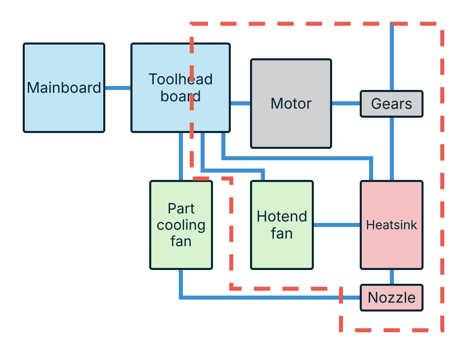
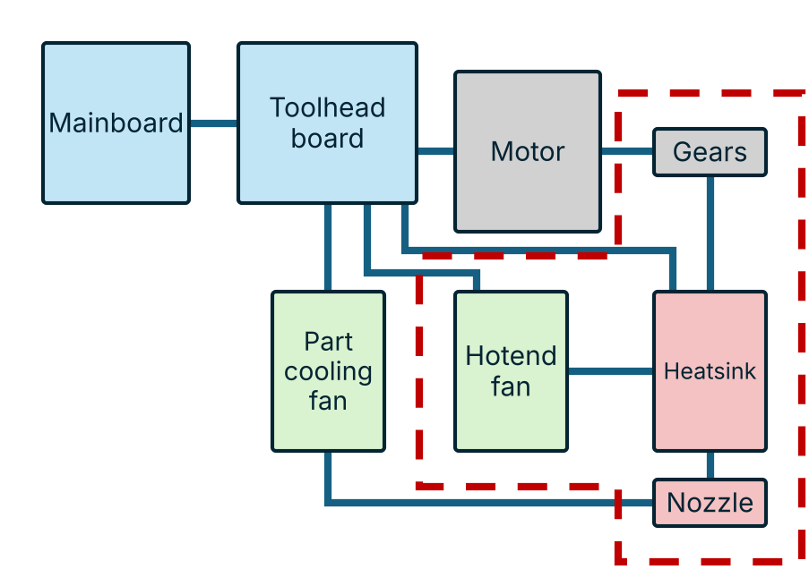
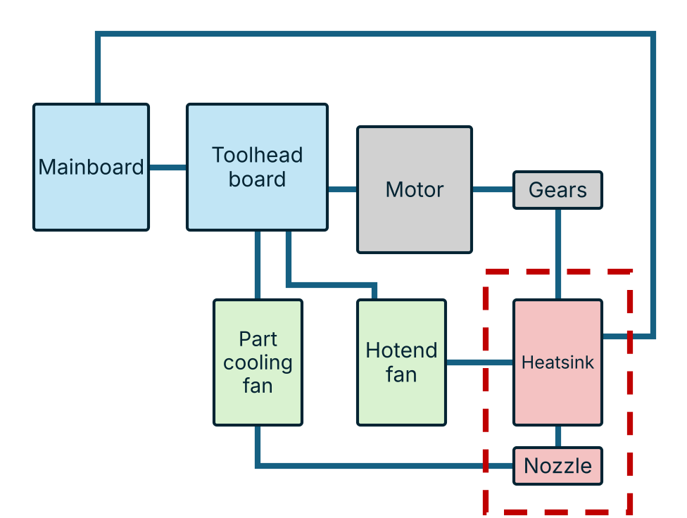
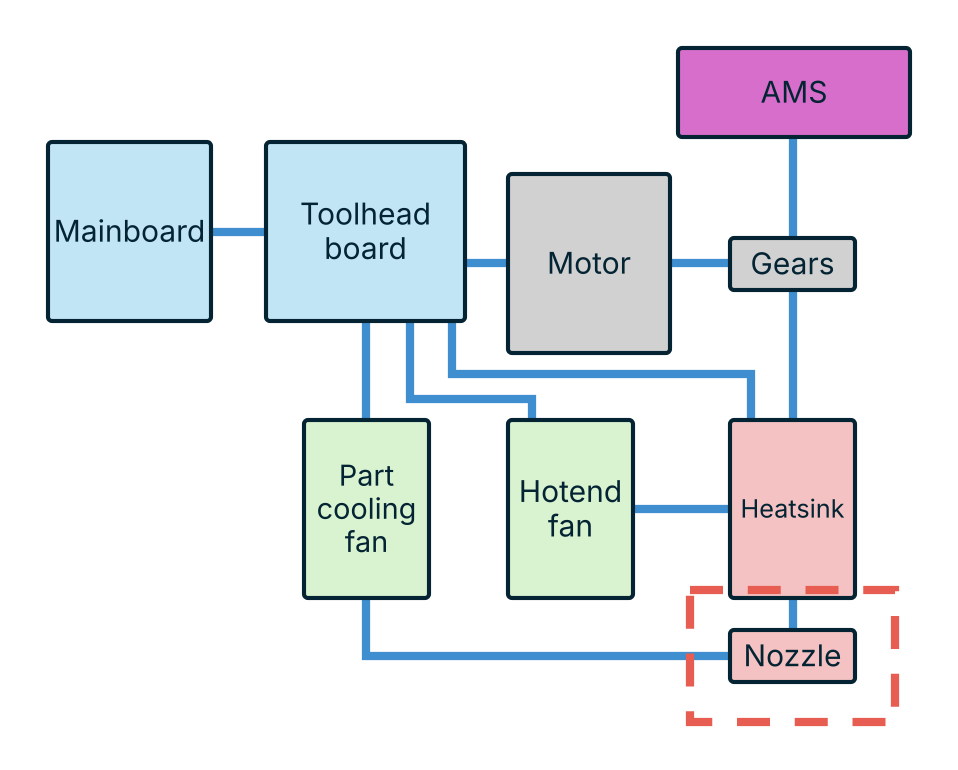

# Toolchanger Classes

--8<-- "plate.html"

## Conventional toolchangers

Full conventional

{ .tc-detail-fig }

The whole toolhead travels. Each tool carries its own extruder motor, gears, fans, heat break and control board, so the only thing broken at a change is the link back to the mainboard.

**Pros**

- One connection to break and remake.
- Tools are self-contained, so one can be built or debugged on its own.
- Nothing is shared between tools, so a fault stays in one tool.

**Cons**

- A tool costs a whole toolhead.
- Most mass to accelerate and to dock.
- Most parts per tool to keep calibrated.

--8<-- "type-full_conventional.md"

Partial conventional

{ .tc-detail-fig }

The tool keeps the extruder and the hot end but leaves the part cooling fan on the carriage, along with some of the toolhead electronics.

**Pros**

- Cheaper per tool than a full toolhead.
- Part cooling and its duct never have to survive docking.

**Cons**

- Part cooling has to reach whatever tool is mounted.
- More connections cross the joint than in a full conventional.

--8<-- "type-partial_conventional.md"

## Filament path changers

Gear swapping

{ .tc-detail-fig }

The extruder motor stays on the carriage and the drive gears travel with the tool along with the hot end. The split is in the middle of the extruder.

**Pros**

- Motor mass stays off the tool.
- Cheaper tools than carrying a whole extruder.

**Cons**

- The drive coupling has to re-engage accurately every change.
- Filament stays loaded in the tool between changes.

--8<-- "type-gear_swapping.md"

Hotend fan swapping

{ .tc-detail-fig }

The hot end travels with its own heat break fan. The extruder and part cooling stay behind, so filament is cut or retracted at the change.

**Pros**

- Small, cheap tools.
- Each hot end keeps the heat break fan it was designed around.

**Cons**

- Filament has to be pulled clear before a change and re-fed after.
- Fan power and the heater circuit both cross the joint.

--8<-- "type-hotend_fan_swapping.md"

Inductive / pogo changers

{ .tc-detail-fig }

Only the heat break and nozzle travel. The heater and thermistor cross the joint through spring pins or an inductive coupling, so nothing is plugged in by hand.

**Pros**

- Smallest and cheapest tools of the filament path changers.
- No cable to route or manage per tool.

**Cons**

- The contact has to carry heater current for thousands of cycles.
- Dirt or oxide at the interface shows up as a heating fault.

--8<-- "type-inductive_pogo.md"

Wired

{ .tc-detail-fig }

The same split as inductive/pogo, but the heater and thermistor stay on a wire back to the board instead of crossing a contact.

**Pros**

- A crimped or soldered joint is more predictable than a contact.
- No pin wear.

**Cons**

- Each tool stays tethered, which limits where tools can be parked.
- Cable management gets harder with every tool added.

--8<-- "type-wired.md"

## Hotend changers

AMS-assisted hotend changers

{ .tc-detail-fig }

A hot end changer paired with an automatic material system. The AMS handles filament, so the tool only carries the heat break and nozzle.

**Pros**

- Filament handling and tool changing stay separate problems.
- Cheap tools.

**Cons**

- Depends on the AMS to feed and retract reliably.
- Purge and load time on every material change.

--8<-- "type-ams_assisted_hotend_changer.md"

AMS-assisted nozzle changers

{ .tc-detail-fig }

Only the nozzle is swapped. The heat break, fans and extruder all stay on the machine and the AMS feeds filament.

**Pros**

- The smallest and cheapest thing to duplicate per tool.
- Almost no mass added to the carriage.

**Cons**

- The nozzle joint has to seal at temperature every time.
- Everything upstream is shared, so tools can only differ in nozzle geometry.

--8<-- "type-ams_assisted_nozzle_changer.md"

## All systems

--8<-- "systems-all.md"
