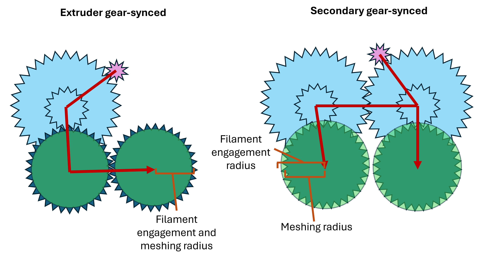
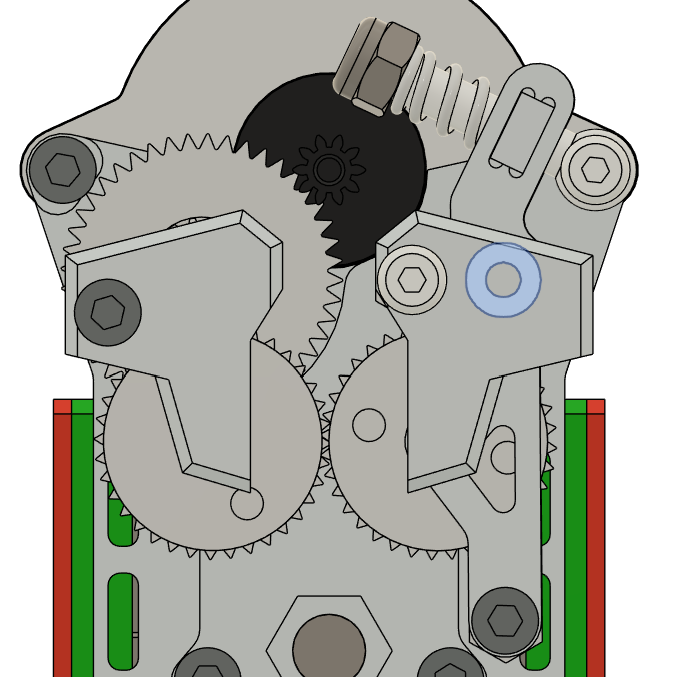
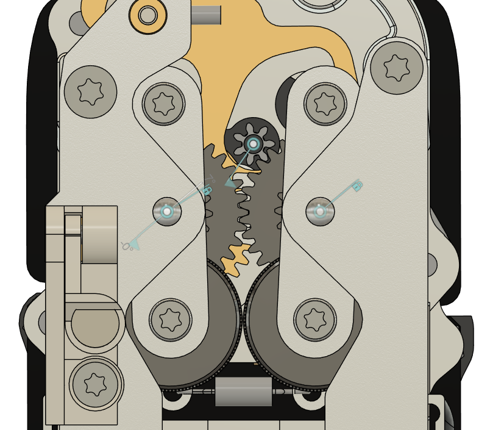
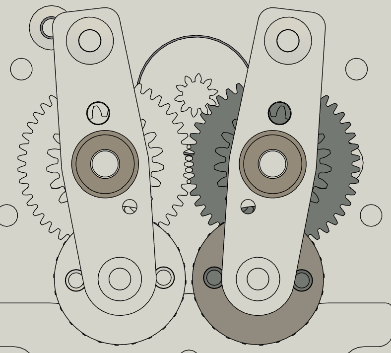
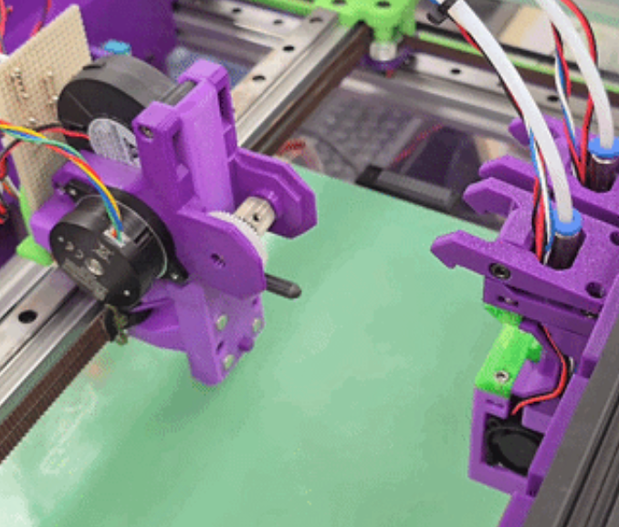
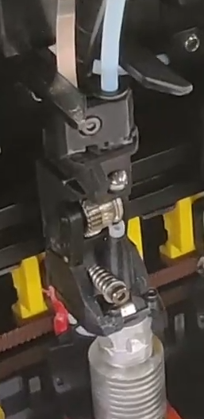

# Drivetrain design

The reduction gearing used by filament path changers is worth remarking on. There are two main categories of drivetrain in
these systems, and one minor one, each with its own design considerations. They
are categorised here by how the two sides of the drivetrain are synced. Both of
the major arrangements use multistage spur gear secondaries, in the manner of
LGX gears.

<figure markdown="1">
  { width="700" }
  <figcaption>The two major arrangements, with the torque path in red. Left: one
  secondary is driven, and the drive only reaches the second extruder gear
  because the two extruder gears mesh with each other, their teeth sit at the
  diameter that also engages the filament. Right: both secondaries are driven
  and synced to each other, and each turns its own extruder gear. The extruder
  gear teeth are inset inside the filament engagement diameter (pale rim), so
  the two never touch.</figcaption>
</figure>

## Extruder gear-synced drivetrains

These are the closest to their LGX/HGX progenitors. The driven side is
stationary and only the filament arm pivots, actuated by pressing sideways
against the dock to dock or undock a tool. Because one side of the drivetrain
does not move at all, some lateral movement of the filament is needed. As in a
normal extruder, the tensioner arm pivot need not be coaxial with either gear.

<figure markdown="1">
  { width="430" }
  <figcaption>CxChanger. The arm pivots on the shoulder bolt above the gear, not
  on a gear centre. On the lower extruder gears, meshing radius and
  filament engagement radius are the same, so the two sides stay
  synced through the extruder gears themselves.</figcaption>
</figure>

Systems of this type are essentially LGX or HGX extruders with an extended
tensioner lever and a larger range of tensioner movement. Ordinary HGX/LGX
extruder gears, those where meshing radius ≈ filament engagement radius, can
therefore be used.

## Secondary gear-synced drivetrains

These are closer to the dynamic extruder used in INDX. Both arms swing open and
closed, the pivot for each is coaxial with its secondary gear, and the two arms
are synced by the secondary gears rather than by the extruder gears.

<figure class="tc-pair" markdown="1">
{ width="330" } { width="330" }
<figcaption>INDX (left) and YUDX (right). In both, each arm pivots on the axis
  of its own secondary gear, so the secondaries stay meshed through the full
  range of arm travel. The lower extruder gears never touch each other: their
  meshing diameter is smaller than the diameter that engages the
  filament.</figcaption>
</figure>

This is arguably the more elegant design, in that the arms swing cleanly open to
let the filament clear during docking and undocking. There is a practical catch
for anyone wanting to use it in a FOSS design, though.

The extruder gears here must have meshing diameter < filament engagement
diameter, so that they mesh only with their secondaries and never with each
other. Ordinary extruder gears do not: meshing radius ≈ filament engagement
radius, so putting a pair of them in this arrangement closes the drivetrain into
a loop, synced at both the secondaries and the extruder gears. In a fixed
drivetrain that causes no great problem, but in a pivoting arm system the
effective meshing diameter of the extruder gears varies with how far open the
arms are, which can show up as chatter and extrusion artifacts.

Nothing on the market at the time of writing meets that requirement, which is
why YUDX has as many custom gears as it does. That may not continue to be the case,
several designs now use gears of this kind, so they are likely to become easier
to source.

## Tool–carriage synced drivetrains

This atypical type is used in the Oosaka and in the unnamed toolchanger designed
by Matti. The motor axis may be rotated 90 degrees from its usual orientation so
that it lies along X. Mechanically it resembles an extruder gear-synced
drivetrain, but with the tensioner gear on the tool instead of the carriage.
Such systems have to resist the tensioner trying to decouple the tool from the
carriage, and in exchange they avoid needing a complex opening motion to
accommodate the filament path.

<figure class="tc-pair" markdown="1">
{ width="340" } { width="141" }
<figcaption>Oosaka (left) and Matti's toolchanger (right). In both the drive
gear sits exposed on a shaft pointing along X, with nothing enclosing it. The
filament is engaged only once a tool brings its own sprung tensioner gear up
against it.</figcaption>
</figure>

These may look like gear swapping toolchangers. They are not counted as such
here, because the tool–carriage interface is still the filament path, as it is
in the wired, pogo/inductive and hotend fan swapping types. Gear swapping
extruders such as the Flashforge Creator 5 do not split along the filament path
at all; they split between the extruder gears and the motor. Tool–carriage
synced drivetrains therefore face problems closer to those of the wired filament
path changers, an extruder applying a decoupling force to the tool, than to
those of the gear swapping type, which are custom gears and meshing during
docking and undocking.
