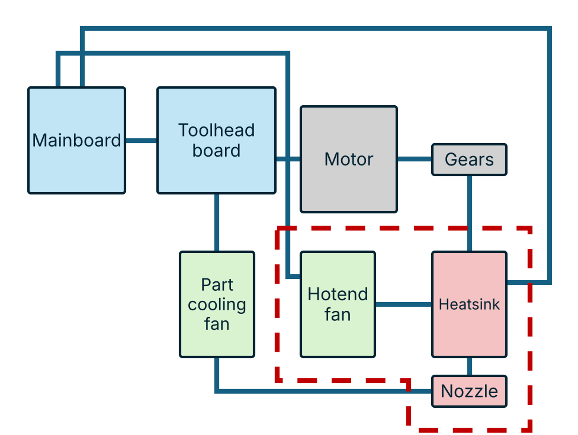

# Hotend fan swapping path changers

{ .tc-detail-fig }

The hot end travels with its own heat break fan. The extruder and part cooling stay behind; the extruder gears open for filament path changes.

**Pros**

- Small, cheap tools.
- Prevents heat creep compared to systems that do not carry a hotend fan, more flexibility for preheating.

**Cons**

- Gears have to open and re-engage filament path every time.
- More challenging for flexible materials than conventional toolchangers.
- More wiring than similar systems that don't carry a hotend fan on the tool.
- Extruder places variable load on kinematic coupling.

## Systems

--8<-- "type-hotend_fan_swapping.md"
